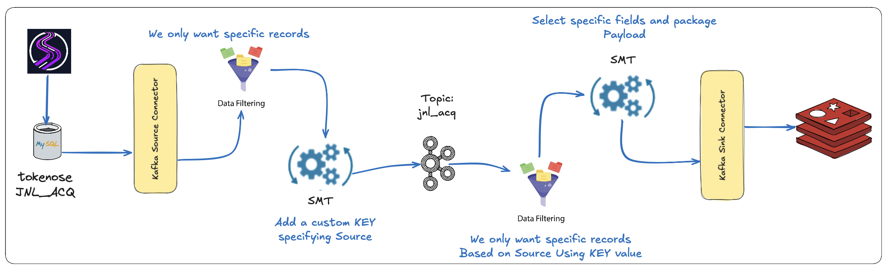

## From data generator, into MySQL, into Kafka via Source Connector (and a custom SMT), filtered and persisted into REDIS using another custom SMT/Kafka Sink Connector.

Welcome back to the Rabbit Hole.

### Blog Overview

So, as per the tittle, a little data flow.

1. We start by first generating records using Shadowtraffic, insert the records into a MySQL datastore.

2. We then utilise Kafka Connect Source connector with a custom SMT consume the records from the MySQL datastore, filtering out specific records and publishing they, together with a user defined Key onto a topic.

3. From here we use a Kafka Connect framework Sink connector, again with a SMT function filter our records package (specified fields) into a Key/Value record into a REDIS datastore.

The two Single Message Transforms (SMT's) Functions are Java based, full disclosure, Java is not my thing so abused Claude and Gemini a bit here. Hey we use the tools available.

GIT: [MySQL_via_KafkaConnect_into_Redis_with_some_SMT]()

### Building Lab

First Execute: 

- `cd <Project root>/infrastructure`

- `make pull` 
  - Pull Confluent based images
  - Pull Various Database images

- `make build`
  - Build Images, primarily, the Kafka Connect image thats extended with the MySQL Source and REDIS Sink modules

- `cd devlab/creSMT/kafka-custom-smt`

- `mvn package clean`
  - Java compile/build the SMT functions/classes used by the Kafka Source and Sink connectors

### Running Lab

- `cd <Project root>/devlab`

- `make run`

- `make createtopics`
  - Create the jnl_acq Topic

- `cd <Project root>/shadowtraffic`

- `./run_1.sh`
  - Start the MySQL Record Generator

- `cd <Project root>/devlab/creConnect`

- `./jnl_acq_mysql_source-SMT.sh`
  - Create the Kafka Connect MySQL Source Connector

- `./jnl_acq_redis_sink-SMT.sh`
  - Create the Kafka Connect REDIS Sink Connector
  
### Misc

Oh, b.t.w, if you see `<Project Root/devlab/redis `you will find a little `purge.sh` script that can be run using a cron job to manage the amount of records in the REDIS in memory store, this TTL... without using TTL.

## Summary

This is for my side part of a larger "concept" that I'm playing with, but figured it would be useful for others.

We generated some data, very fake... ;) insert that into MySQL, then create a Kakfa Connect Source connector to consume the data, but not all of, we had a filter function using a Single Message Transform function.

We then have a Kafka Connect Sink Connector, again filtering specific information, selecting a subset of columns and sinking that into a REDIS in memory store.

Nifty, I think.

**THE END**

Thanks for following. Till next time.

### The Rabbit Hole

And like that we’re done with our little trip down another Rabbit Hole.

## ABOUT ME

I’m a techie, a technologist, always curious, love data, have for as long as I can remember always worked with data in one form or the other, Database admin, Database product lead, data platforms architect, infrastructure architect hosting databases, backing it up, optimizing performance, accessing it. Data data data… it makes the world go round.
In recent years, pivoted into a more generic Technology Architect role, capable of full stack architecture.

### By: George Leonard

- georgelza@gmail.com
- https://www.linkedin.com/in/george-leonard-945b502/
- https://medium.com/@georgelza

## Regarding our Stack

The following stack is deployed using one of the provided  `<Project Root>/devlab/docker-compose.yaml` files as per above.

- [Confluent Kafka](https://www.confluent.io) - we used 7.9.1

- [MySQL](https://www.mysql.com)

- [REDIS](https://redis.io)

- [ShadowTraffic](https://shadowtraffic.io)