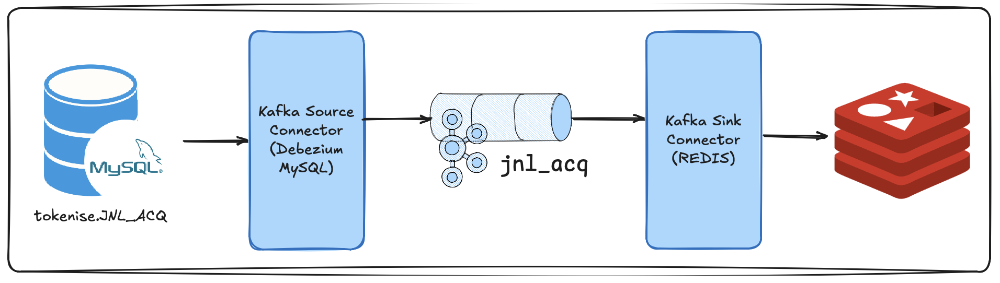

## From ShadowTraffic, into MySQL, into Kafka using Source Connector (& a SMT), filtered, packaged & sinked into REDIS using Kafka Sink Connector (& another SMT)

Welcome back to [The Rabbit Hole](https://medium.com/@georgelza/list/the-rabbit-hole-0df8e3155e33).


### Blog Overview

So, as per the tittle, a little data flow.

1. We start by first generating records using [Shadowtraffic](https://shadowtraffic.io). 

2. Insert the records created into a [MySQL](https://www.mysql.com) datastore.

3. We then utilise Kafka Connect Source Connector with a custom SMT to consume the records from our [MySQL](https://www.mysql.com) datastore, filtering out specific records, after adding a custom [Message Key](https://www.confluent.io/learn/kafka-message-key/) (not based on a column) as we publish onto specified [Apache Kafka](https://kafka.apache.org) topic.

4. From here we use a [Kafka](https://kafka.apache.org) Connect Sink Connector, again with a custom SMT function to filter our records, package (specified columns) into a Key/Value JSON payload into a [REDIS](https://redis.io) datastore.




See: 

- [What is Kafka Connect Framework - Core Components](https://developer.confluent.io/learn-more/podcasts/intro-to-kafka-connect-core-components-and-architecture-ft-robin-moffatt/)
- [Kafka Connect Overview](https://kafka.apache.org/41/kafka-connect/overview/)
- [Confluent Market Place: Kafka Source and Sink Connectors](https://www.confluent.io/hub/)

The two [Single Message Transforms (SMT's)](https://docs.confluent.io/kafka-connectors/transforms/current/overview.html) functions are Java based, full disclosure, Java is not my thing so abused [Claude](https://claude.ai/new) and [Gemini](https://gemini.google.com/app) a bit here. Hey we use the tools available.

See:
- <Project root/README.md>,
- <Project root/devlab/creConnect/README.md>

for a more detailed description.

GIT: [MySQL_via_KafkaConnect_into_Redis_with_some_SMT](https://github.com/georgelza/MySQL_via_KafkaConnect_into_Redis_with_some_SMT.git)

BLOG: [From ShadowTraffic, into MySQL, into Kafka using Source Connector (& a SMT), filtered, packaged & sinked into REDIS using Kafka Sink Connector (& another SMT)]()


### Building Lab

First Execute: 

- cd <Project root>/infrastructure

- make pull

  - Pull Confluent based images

  - Pull Various Database images

- make build

  - Build Images, primarily, the Kafka Connect image thats extended with the [MySQL](https://www.mysql.com) Source and [REDIS](https://redis.io) Sink modules

- cd devlab/creSMT/kafka-custom-smt

- mvn package clean

  - Java compile/build the SMT functions/classes used by the Kafka Source and Sink connectors


### Running Lab

- cd <Project root>/devlab

- make run

- make createtopics

  - Create the jnl_acq Topic

- cd <Project root>/shadowtraffic

- ./run_1.sh

  - Start the MySQL Record Generator

- cd <Project root>/devlab/creConnect

- ./jnl_acq_mysql_source-SMT.sh

  - Create the Kafka Connect MySQL Source Connector

- ./jnl_acq_redis_sink-SMT.sh

  - Create the Kafka Connect REDIS Sink Connector
  
## Monitoring

At this point you can monitor your Kafka topic for the inbound records using kcat, formarly kafkacat.

### Kafka Topic

``` bash
# See the last 10 record Key's
kcat -b localhost:9092 -t jnl_acq -C -f 'Key: %k\n' -c 10

# See continious feed of record Key's
kcat -b localhost:9092 -t jnl_acq -C -f 'Key: %k\n'

# See raw message published onto jnl_acq topic
kcat -b localhost:9092 -t jnl_acq -C -o end -f 'Key: %k | Timestamp: %T\nValue: %s\n\n'

# See beautified, using jq message as published onto our jnl_acq topic
kcat -b localhost:9092 -t jnl_acq -C -f 'Key: %k\n%s\n' -c 1 | tail -n +2 | jq .
```

### Redis DB store

```bash
# Enter Redis Container
docker exec -it redis redis-cli -n 0

# Enter below, this will then display ALL keys
keys * 

# Enter below, this will then display ALL keys starting with 074
keys 074*
```

For my usage I installed kcat and [REDIS](https://redis.io) locally, giving me access to redis-cli. This also made running the purge.sh as per below easier.


### Misc


Oh, b.t.w, if you see `<Project Root/devlab/redis` you will find a little `purge.sh `script that can be run using a cron job to manage the amount of records in the [REDIS](https://redis.io) in memory store, this TTL… without using TTL.

## Summary

This, for my side is part of a larger “concept” that I’m playing with, but figured it would be useful for others.


We generated some data, very fake… ;) using ShadowTraffic utility by Michael Drogalis, insert that into [MySQL](https://www.mysql.com), then use a Kakfa Connect Source connector to consume the data using CDC, but not all of, we filter it and use a Single Message Transform function to modify it, slightly ;).

We then have a Kafka Connect Sink Connector configured, again using a SMT to select/include specific records and only a subset of the columns and sinking the now compiled result set into a [REDIS](https://redis.io) in memory datastore as a Key/Value pair.

Nifty, I think.


**THE END**


And like that we’re done with our little trip down another Rabbit Hole...

Thanks for following, till next time.


### The Rabbit Hole


And like that we’re done with our little trip down another Rabbit Hole.


## ABOUT ME

I’m a techie, a technologist, always curious, love data, have for as long as I can remember always worked with data in one form or the other, Database admin, Database product lead, data platforms architect, infrastructure architect hosting databases, backing it up, optimizing performance, accessing it. Data data data… it makes the world go round.
In recent years, pivoted into a more generic Technology Architect role, capable of full stack architecture.

### By: George Leonard

- georgelza@gmail.com
- https://www.linkedin.com/in/george-leonard-945b502/
- https://medium.com/@georgelza


## Regarding our Stack

The following stack is deployed using one of the provided  `<Project Root>/devlab/docker-compose.yaml` files as per above.

- [Confluent Kafka](https://www.confluent.io) - we used 7.9.1

- [MySQL](https://www.mysql.com)

- [REDIS](https://redis.io)

- [ShadowTraffic](https://shadowtraffic.io)